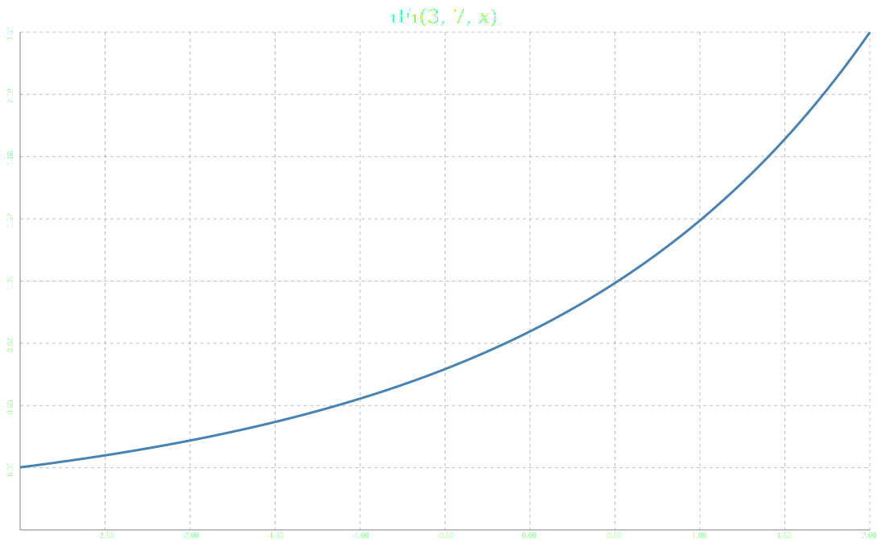
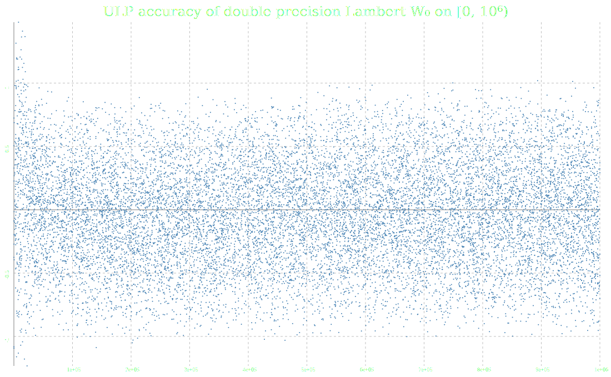

# quicksvg

This is a tiny library for generating SVG files from within C++. It plots time series, and graphs functions, and that's it. If you use it, you should think "huh, that kinda did what I wanted", and accept that the result is good enough, or you should give up immediately.

Here's some examples of a function graphed:





Here's an example of a time series:


Here's an example of a ULP accuracy plot:




How do we graph a function?

```cpp
#include "quicksvg/graph_fn.hpp"
// ...
double a = -3.14159;
double b = 3.14159;
std::string title = "sin(𝑥) and cos(𝑥)";
std::string filename = "examples/sine_and_cosine.svg";
auto f = [](double x)->double { return std::sin(x); };
auto g = [](double x)->double { return std::cos(x); };
quicksvg::graph_fn sin_graph(a, b, title, filename);

sin_graph.add_fn(f);
sin_graph.add_fn(g, "green");

sin_graph.write_all();
```

How do we graph a time series?

```cpp
#include "quicksvg/plot_time_series.hpp"
// ...
std::vector<double> v(50);
std::vector<double> u(50);
double start_time = 0;
double time_step = 0.25;
for (size_t i = 0; i < v.size(); ++i) {
  v[i] = std::sin(start_time + i*time_step);
  u[i] = std::cos(start_time + i*time_step);
}

title = "sine and cosine time series";
filename = "examples/sin_cos_time_series.svg";

quicksvg::plot_time_series pts(start_time, time_step, title, filename);
pts.add_dataset(v);
pts.add_dataset(u, /* connect the dots? */ false, "lime", "lightgreen");
pts.write_all();
```

How do we create a ULP accuracy plot?

```cpp
#include "quicksvg/ulp_plot.hpp"
// ...
int samples = 25000;

a = 0;
b = 1000000;
title = "ULP accuracy of double precision Lambert W₀ on [0, 10⁶)";
filename = "examples/ulp_lambert_w0_0_mil.svg";
std::cout << title << "\n";
quicksvg::ulp_plot(lambert_w0<double>, lambert_w0<float128>, a, b, title, filename, samples);
```
